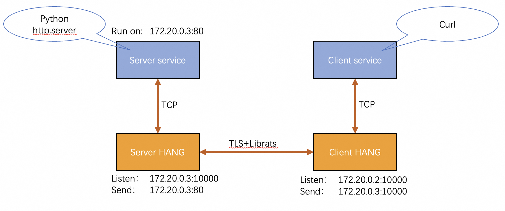
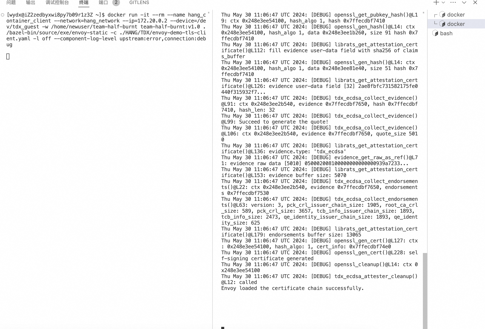
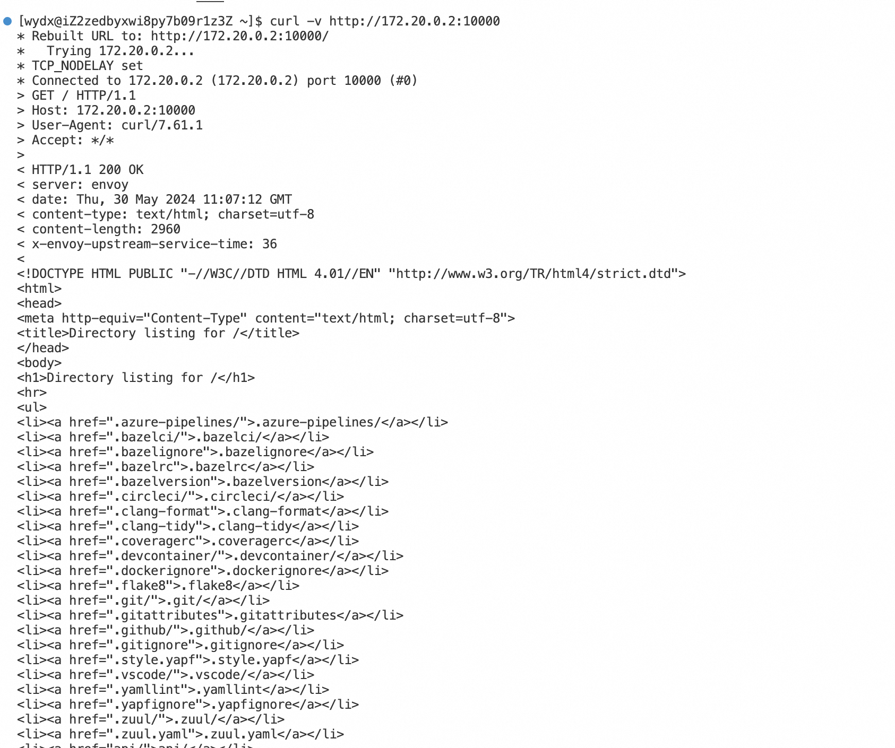
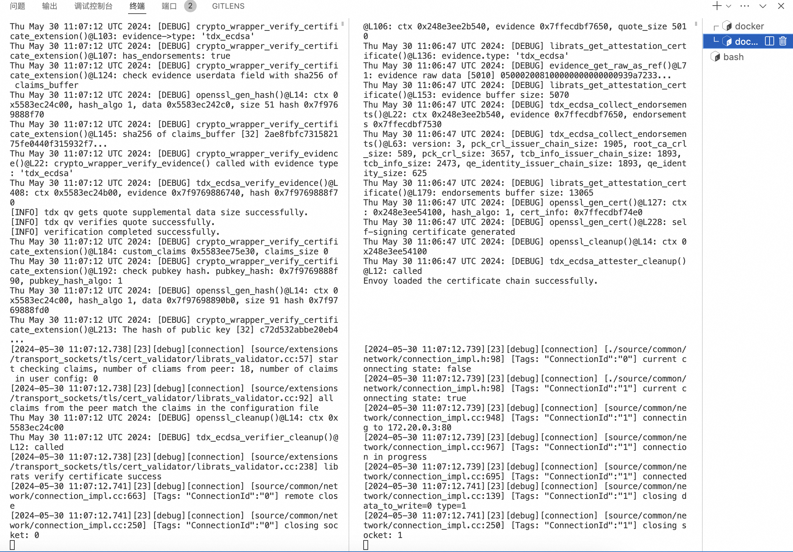

# 2025年全国大学生计算机系统能力大赛-操作系统设计赛(全国)-OS功能挑战赛道    
    
## 赛题简介：    
目前AIGC类推理服务型应用爆火，但目前所有推理服务几乎都面临如下安全风险:    
1.大模型所在系统的安全问题，将导致大量高度机密和敏感的训练数据（如个人隐私数据和企业数据）以及高价值的模型参数信息被泄露。    
2.模型提供者会因与平台提供者的所有权不同而产生的信任问题，导致不敢使用平台提供者提供的计算平台。    
3.企业用户无意间输入的包含企业机密信息的prompt被泄露给AIGC类应用。    
4.为了解决上述第三个问题，需要实现一种TEE安全可信网关架构和组件。    

## 目标描述/预期特征：  
TEE安全可信网关组件应满足：   
1.通信必须基于远程证明的可信信道，确保通信双方的身份认证和数据完整性    
2.包含完整的TEE远程证明组件    
3.支持至少两种TEE平台    
4.本地推理服务Client侧和远端的推理服务Server侧应各应有一个TEE安全可信网关来代表各自的网络，并基于可信信道进行通信，确保网络间的安全连接。     
5.推理服务端和推理客户端应基于开源软件方案，并结合TEE安全可信网关完成端到端的DEMO。    
6.（加分项）框架应兼容多种网络形态，并支持N:M网络通信，即任意数量的客户端可以与任意数量的服务器进行安全通信，解决两个网络内任意C/S（客户端/服务器）应用间的安全可信通信问题。    
7.（加分项）在推理客户端也是TEE的情况下，能够让推理服务端验证出推理客户端是符合预期的TEE。    
预期目标：    
在尽可能少甚至无需修改推理服务（作为C/S模型中的Server）和推理客户端（作为C/S模型中的Client，通常为REST API或Web UI前端等形式）的前提下，设计并实现一个TEE网关，实现安全可信的通信框架，不仅保证推理客户端和推理服务之间的通信内容安全，还能基于TEE远程证明过程验证运行在TEE内的推理服务的可信度。    

## 比赛题目分析+相关资料调研/项目简介：
选择在[envoy开源网关 版本1.28.0-dev](https://github.com/inclavare-containers/envoy_librats/tree/706fe7871ab5fe631406db1e0fe5af1c4d0eb1b8)的基础上进行改造；并选择了inclavare-containers下的[librats](https://github.com/inclavare-containers/librats)作为技术支持进行引入，将librats技术运用在网关上，并对其进行envoy的适配改造，同时修改envoy的transport socket上下文，将TEE远程证明与TLS相结合，实现网关之间可信信道的建立。

## 项目实现：
旨在使用网关技术，满足在各种场景下（包括但不限于AIGC）的C/S模型通信需求，在不修改Client service和Server service的情况下，完成对可信信道的建立并基于TEE远程证明验证处于Server端推理服务可信度。项目同时做到了：    
- [x] 项目的TLS通信基于远程证明，C端可以验证S端身份信息和数据完整性。     
- [x] 项目使用开源的librats作为远程证明组件，在envoy中修改TLS并完成远程证明    
- [x] 项目支持SGX与TDX平台进行构建，项目基于TDX进行演示，SGX同理   
- [x] 项目的C/S端各有一个网关，在网关之间完成可信信道的建立   
- [x] 项目的客户端和服务端基于python和curl完成了demo演示，同时提供了完整的构建方案和步骤指南     
- [x] 可以从dockerfile、dockerhub、source三个层面完成项目的构建      

## 开发计划
- 完成对envoy yaml文件配置源码修改
- 添加envoy对librats依赖
- 分别实现客户端/服务端transport_socket部分源码
- 撰写相关测试和文档

## 提交仓库目录和文件描述
项目对envoy源码围绕transport socket和secret相关进行了部分源码改造和增加，涉及到的文件包括：    
1.在envoy yaml配置文件中添加librat配置      
- api/envoy/extensions/transport_sockets/tls/v3/common.proto   
- api/envoy/extensions/transport_sockets/tls/v3/tls.proto   
- api/envoy/extensions/transport_sockets/tls/v3/tls_librats_config.proto   

2.在envoy构建中，添加librats库，将librats作为envoy动态链接库   
- bazel/external/librats.BUILD    
- bazel/repositories.bzl  
   
3.添加librats证书生成和传输逻辑   
- envoy/secret/secret_manager.h    
- envoy/secret/secret_provider.h     
- source/common/secret/BUILD   
- source/common/secret/librats_secret_provider_impl.cc   
- source/common/secret/librats_secret_provider_impl.h   
- source/common/secret/secret_manager_impl.cc   
- source/common/secret/secret_manager_impl.h   
  
4.添加librats证书验证和传输逻辑   
- source/extensions/extensions_build_config.bzl    
- source/extensions/transport_sockets/tls/BUILD    
- source/extensions/transport_sockets/tls/cert_validator/BUILD  
- source/extensions/transport_sockets/tls/cert_validator/default_validator.cc   
- source/extensions/transport_sockets/tls/cert_validator/librats_validator.cc  
- source/extensions/transport_sockets/tls/cert_validator/librats_validator.h   
  
5.新增librats协议选择逻辑   
- source/extensions/transport_sockets/tls/context_config_impl.cc   
- source/extensions/transport_sockets/tls/context_impl.cc   

6.撰写文档、添加librats配置   
- HANG/TDX/Dockerfile    
- HANG/TDX/README.md   
- HANG/TDX/envoy-demo-tls-client.yaml   
- HANG/TDX/envoy-demo-tls-server.yaml   
- HANG/TDX/PCCS_config/sgx_default_qcnl.conf    
- mobile/envoy_build_config/extension_registry.cc   

具体修改内容可以大致参考commit 7d9da4e44eb006eb1ffb8015c91bdacbaf16d906。   

### 系统框架设计/demo框架：
结构图如下所示：  
     
过程如下：    
1.C端向S端发起请求链接，通过向C端网关发起请求（demo中使用curl指令）    
2.C端网关会将请求反向代理到S端网关      
3.S端网关收到请求后，与C端网关完成TLS可信信道建立。在TLS第二次握手，S端网关会将Server service所处的TEE环境quote嵌入到X509证书的扩展部分，传递给C端网关；C端网关在接收到X509证书之后，会获取其扩展部分的TEE quote并进行远程证明，证明成功后，C端网关才会进行第三次TLS握手，否则链接建立失败。      
4.S端网关和C端网关完成TLS握手，完成可信信道建立。    

整体链路的安全性由TLS保护，同时通过TEE quote远程证明的方式完成了C端对S端安全性的验证，传输过程中TLS的X509证书本质上是一个自签名证书，其公钥hash值会在TEE quote中存储，而TEE quote由TEE内部私钥签名，只有对应TEE硬件厂商才能解密，本质上是由TEE quote充当了HANG中X509证书的上一级证书。   

## 系统测试情况/结果演示：   
由于设备限制，项目采用docker的方式，将C端和S端的网关部署在同一台机器上，并通过docker network进行通信。实际场景可随意将C/S端网关部署在不同的SGX/TDX机器上，只需要在yaml配置文件中配置好IP地址和端口号以及attester、verifier策略就没问题。    
     
上图为连接建立前的C/S端网关输出信息，可以看到提示信息加载证书成功。    
     
上图为C端service发出请求的结果，demo里的C端service用curl指令模拟，S端service用http.server模拟，收到来自python的信息则表示C/S端servic连接建立成功。     
     
上图为连接建立后端C/S端网关输出信息，可以看到C端网关对TDX验证成功提示信息。      
上述结果演示中，使用了-l off参数屏蔽了envoy的INFO输出，推荐使用-l debug参数显示DEBUG信息，我将TDX证书和密钥相关信息输出在了DEBUG信息中，可供验证。     

 

## 参考链接
- https://github.com/envoyproxy/envoy     
- https://github.com/inclavare-containers/librats    
- https://openanolis.cn/sig/coco      
- https://github.com/inclavare-containers/rats-tls    

## 比赛进展
- 比赛过程中，和指导教师沟通顺利，导师也提供了许多技术上支持。
- 项目开发过程中，和队伍成员沟通良好，各自分工，互相配合，较好地完成了比赛目标。

## 遇到的主要问题和解决方法
- 比赛过程中，有很多技术和难点，包括但不限于对envoy对源码层面改造、对librats技术的引入和对其在envoy中对移植，还有TDX设备的使用和对应配置，再到dockerfile的构建和开发记录和文档撰写，整个过程遇到过非常多技术难点。
- 遇到问题的时候，我们会优先自己调研，尝试查看网上是否有类似的解决办法，同时队员之间互相交流讨论，分享开发过程中遇到的难题和经验，一起克服开发困难，同时还会咨询导师，导师也会给出指导性方向和意见，交由我们自主调研。付诸时间和努力，一点一点克服困难。

## 比赛收获
本次比赛中，我们不仅收获了对现有开源框架源码层面的阅读和修改经验，同时也对网关、TEE、librat、远程证明相关技术都有了更深刻的理解，还在比赛过程中不断交流和沟通，增加了大家对计算机领域知识系统性的理解，也有了和小组分工合作的经验，这次比赛收获非常丰富。

# Introduction of HANG
This project aims to combine **Librats** and **Envoy**. We introduce **Librats** into **Envoy** to struct a new network gateway architecture based on TEE， which is called **HANG**.(Heterogeneous Authentication Network Gateway)

User can find the building instructions in [/HANG/TDX](HANG/TDX/).

HANG based on open source project [envoy 1.28.0-dev](https://github.com/inclavare-containers/envoy_librats/tree/706fe7871ab5fe631406db1e0fe5af1c4d0eb1b8) and [librats](https://github.com/inclavare-containers/librats).

Based on envoy source code, this project migrate librats to envoy. Detailed infomation please see commit log to find.
